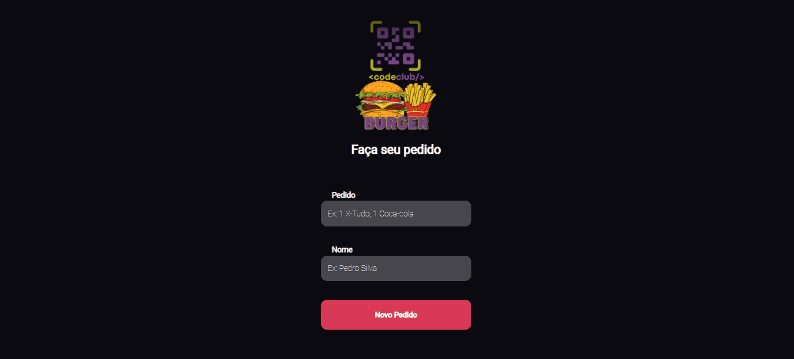

<h1 align="center"> 
    
</h1>

> ## 💻 Projeto
Burger é uma aplicação simples consumindo a API do back-end, onde você pode adicionar e excluir pedidos de uma hamburgueria. 
O intuito desse projeto é consolidar conceitos de React.js e consumo de APIs.

Para ver o Back-end clique aqui: [API-Burger](https://github.com/W-Carlos/API-Burger)

> ## 📸 Demo


> ## 🚀 Tecnologias
Esse projeto foi desenvolvido com as seguintes tecnologias:

* [JavaScript](https://developer.mozilla.org/pt-BR/docs/Web/JavaScript)
* [React.js](https://pt-br.reactjs.org/)
* [Node.js](https://nodejs.org/en/)
* [React Hooks](https://pt-br.reactjs.org/docs/hooks-intro.html)
* [Styled-components](https://styled-components.com/)
* [Axios](https://www.npmjs.com/package/axios)

## Pré-requisitos

Antes de começar, você vai precisar ter instalado em sua máquina as seguintes ferramentas:
[Git](https://git-scm.com), [Node.js](https://nodejs.org/en/). 
Além disto é bom ter um editor para trabalhar com o código como [VSCode](https://code.visualstudio.com/)

### 🎲 Rodando o Back End (servidor)

```bash
# Clone este repositório
$ git clone <https://github.com/W-Carlos/BurgerReact.git>

# Acesse a pasta do projeto no terminal/cmd
$ cd BurgerReact

# Instale as dependências
$ yarn
# ou
$ npm install

# Execute a aplicação em modo de desenvolvimento
$ yarn start

# O servidor inciará na porta:3000 - acesse <http://localhost:3000> 

#A página será recarregada se você fizer edições.Você também verá quaisquer erros no console.
```

>## 📄 Licença
Este projeto está sob a licença MIT. Veja o arquivo <a href="https://github.com/W-Carlos/BurgerReact/blob/master/LICENSE">LICENSE</a> para mais detalhes.

---
<p align="center">Feito por Wend Carlos 👋</p>


